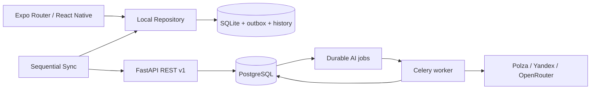
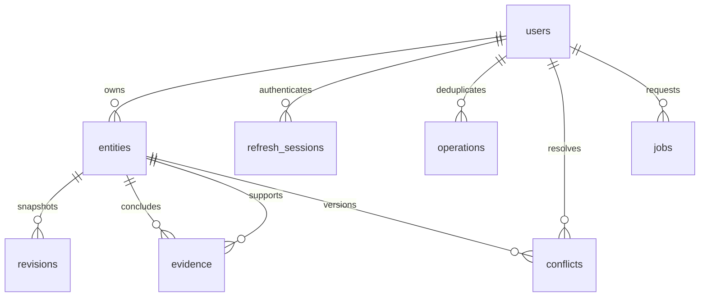

# Архитектура

Клиент разделён на UI/theme, репозиторий, REST client и sync engine. В компонентах
нет SQL. SecureStore хранит сессию, SQLite — данные и владельца локального
журнала. TanStack Query обслуживает удалённые состояния AI jobs.

API использует типизированные DTO, доменный модуль для ревизий/доказательств и
SQLAlchemy unit of work. Для каждой ресурсной группы существуют отдельные REST
маршруты; общей является реализация транзакционного revision envelope.

`entities.kind` различает entry, structured_entry, pattern, hypothesis,
experiment, experiment_suggestion и weekly_review. JSONB content валидируется
ресурсными Pydantic DTO и доменными правилами. Общая оболочка содержит UUID,
владельца, timestamps, revision, source и tombstone. История сохраняет полный
снимок. AI provenance остаётся после ручной правки.

Все изменения доменных сущностей блокируют строку владельца в PostgreSQL.
Это сериализует операции одного пользователя и делает проверки evidence,
идемпотентность, ревизии и удаления атомарными. Разные пользователи независимы.
SQLite backend предназначен только для быстрых локальных тестов, не для cloud.

REST выдаёт ресурсы только их владельцу, включая историю и tombstones. Refresh
tokens хранятся хешированными; rotation с обнаружением повторного использования
отзывает всю refresh family. Access JWT живёт 15 минут. Logout отзывает refresh
sessions, уже выпущенный access JWT действует до истечения срока.

API не логирует тела запросов, токены и дневниковый текст. Redis limiter общий
для процессов; чувствительные операции при недоступном Redis возвращают 503.
Для production нужен TLS и ограничение размера запросов на reverse proxy.
